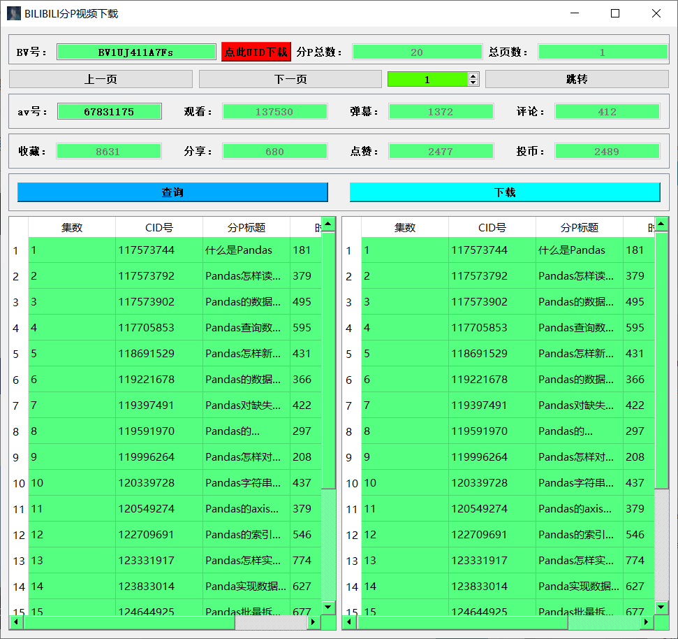
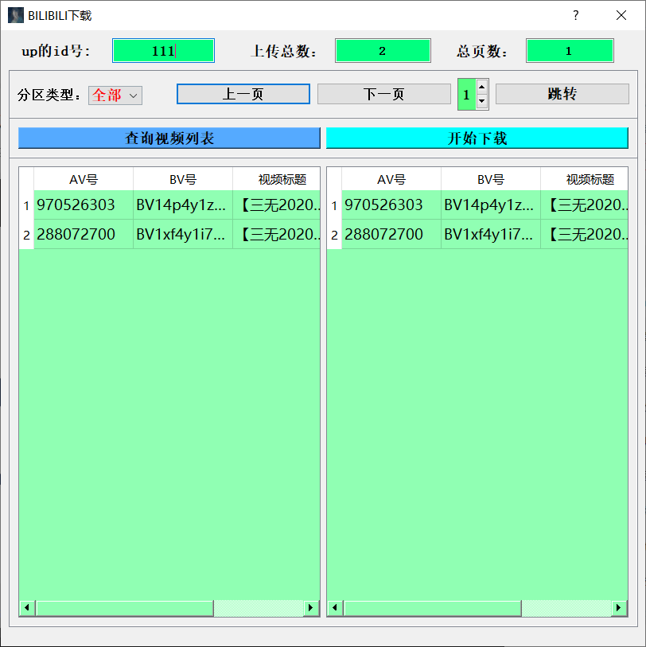

# bili-uget

#### 介绍
批量下载B站up主视频

#### 软件架构
pyqt5
you-get
一个进程负责下载信息输出，另一个进程中单个线程负责界面加载，其他线程中启用协程来实现多个视频同时下载。
一个线程负责界面加载，另一个线程使用协程开启异步多任务下载,但是you-get库会另起一个进程在cmd命令行里输出下载信息。相当于两个进程，多线程加协程，项目最初灵感来自于https://github.com/xiuxinY/BiliBili_Mp4_Download，
自己使用浏览器插件和别的工具总觉得各种不方便，遂看到这个项目后决定在youtube-dl和you-get基础上改进，但是后续下载过程中youtube-dl不使用代理情况下很容易被禁，于是决定用you-get来做。cookies.sqlite文件是空的，如果想下载更高画质的视频可以把你在火狐浏览器的B站登录cookie文件导出，替换掉这个同名文件即可，切不可删掉。

###安装教程

1.  pip install you-get
2.  pip install PyQt5
3.  pip install requests

#### 使用说明

1.  没有python环境的直接执行exe文件即可，不需安装任何包，但是需要下载个ffmpeg,别忘了将ffmpeg.exe所在目录添加到环境变量,
    合并为mp4文件时候需要用到,这个快200M了就不放进来了   [ffmpeg下载](https://pan.baidu.com/s/1ZVWakNq27AnIt8ZvPk6sXw) 提取码: mr45 
2.  有python环境的直接执行.py文件即可
3.  启动页面为分P下载页，可以点击红色按钮跳转到按UP下载，点击关闭按钮自动返回到分P下载页。查询视频列表选中行双击可以添加到下载列表，下载列表选择单行双击可以移除下载列表。
4.  输入BV号或者up主id号后直接回车或者点击查询按钮都可进行查找。

#### 参与贡献

1.  Fork 本仓库
2.  新建 Feat_xxx 分支
3.  提交代码
4.  新建 Pull Request

#### 特技

1.  可以根据up主uid下载该up上传的所有视频，自动以mp4格式保存到exe或.py文件同级的 video/up名/分区/文件名.mp4
2.  支持分区视频下载和同时多个视频下载
3.  cookies.sqlite文件是个空的，如果你是大会员想下载更高清视频可以找下怎么从火狐浏览器导出你的cookie文件，然后替换掉这个文件即可
4.  不要同时下载过多视频，最多不要超过20个。
5.  分P视频的下载还没做过几天会补上，ui文件混在py里代码写的很乱，后续会分离出来
6.  希望用这个更多是下载视频来学习，而不是盗UP的视频谋利。
